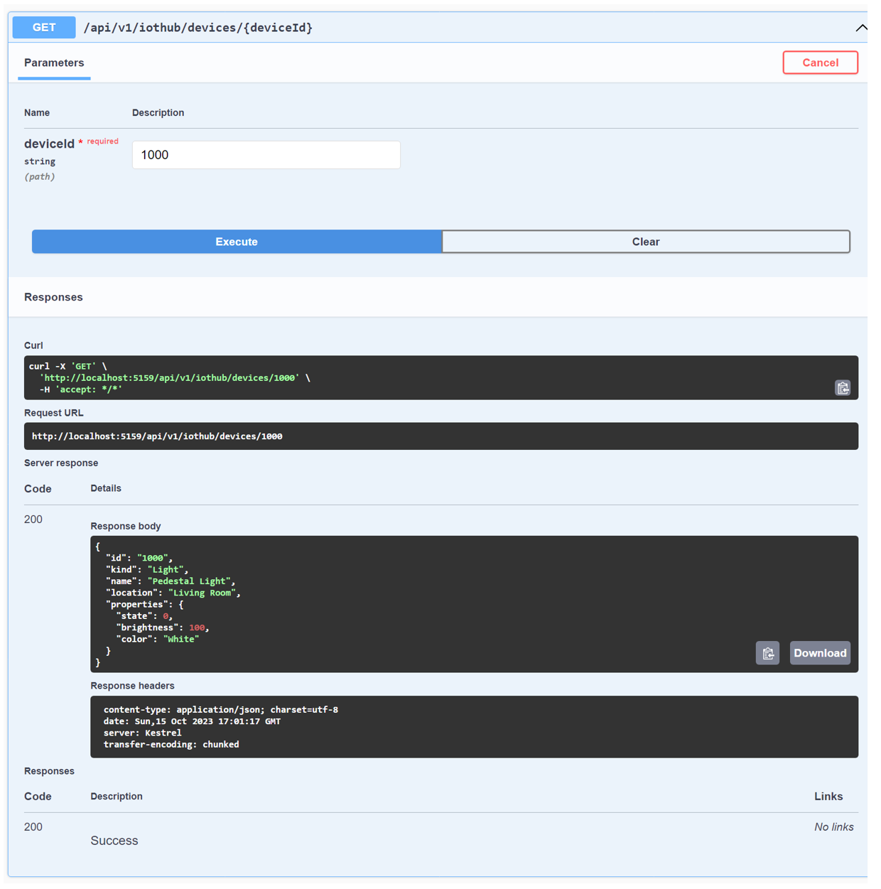
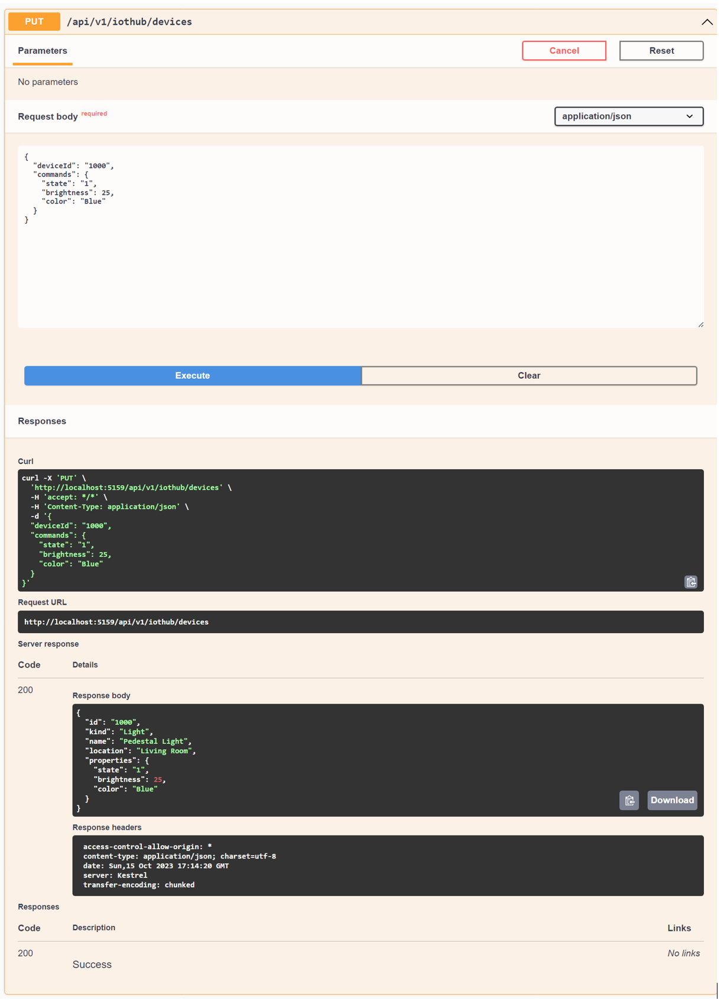

# Azure IoT Hub<br/>Improved Developer experience

This .NET solution implements a Backend and Console applications that can create, run, and update simulated Azure IoT devices registered in Azure IoT Hub. It is designed to decrease the developer experience to work with actual devices.

## Device Registration

This is the endpoint to register a device.

```C#
using var registryManager = RegistryManager.CreateFromConnectionString(registryConnStr);
var device = new Device(deviceId);
device = await registryManager.AddDeviceAsync(device);
return device;
```

## Querying Devices

This is a endpoint to get a list of registered devices and their status in IoT Hub.

```C#
using var registryManager = RegistryManager.CreateFromConnectionString(registryConnStr);
var devices = await registryManager.GetDevicesAsync(100);
```

## Sending device messages (D2C)

Devices send messages to IoT using the SendEvent method.

```C#
await deviceClient.SendEventAsync(message, ct);
Console.WriteLine($"{DateTime.Now} > Sending message: {messageBody}");
```

## Direct method calls (C2D)

Device can implement direct method calls to receive messages which can be used to update the device state for example.

```C#
private async Task<MethodResponse> DirectMethodCallback(MethodRequest methodRequest, object userContext)
    {
        Console.WriteLine($"Received direct method [{methodRequest.Name}] with payload [{methodRequest.DataAsJson}].");
        string messageBody = "";
        byte[] bytes = null!;
        switch (methodRequest.Name)
        {
            case "SetProperties":
```

## Setting Properties using direct method calls

```C#
case "SetProperties":
    try
    {
        var request = JsonSerializer.Deserialize<CommandsRequest>(methodRequest.DataAsJson);
        if (request is not null)
            foreach (var command in request.commands.Keys)
            {
                try
                {
                    device.Properties[command] = request.commands[command];
                    Console.WriteLine($"Setting property {command} to {request.commands[command]}");
                }
                catch
                {
                    Console.WriteLine($"Failed to set property {command} to {request.commands[command]}");
                }
            }
        messageBody = JsonSerializer.Serialize(device);
        bytes = Encoding.ASCII.GetBytes(messageBody);
        return await Task.FromResult(new MethodResponse(bytes, 200));
    }
    catch (Exception ex)
    {

        Console.WriteLine($"Failed ot parse the payload for direct method {methodRequest.Name} due to {ex}");
        break;
    }
```

## Running and Debugging

### Required file (`.env`) or Environment Variables

- For the `IoTCommand.Console` and `IoTCommander.Backend`, create an `.env` file with the following IoT Hub connection strings or make sure to set these as environment variables before starting the applications
- **Important:** In the connection strings should replace the `<NAME>` and `<KEY>` with your IoT Hub values but **NOT** the `<DeviceId>`. This value will be substituted dynamically.

```bash
IOT_SERVICE_CONN_STR="HostName=<NAME>.azure-devices.net;SharedAccessKeyName=service;SharedAccessKey=<KEY>"
IOT_REGISTRY_CONN_STR="HostName=<NAME>.azure-devices.net;SharedAccessKeyName=registryReadWrite;SharedAccessKey=<KEY>"
IOT_DEVICE_CONN_STR="HostName=<NAME>.azure-devices.net;DeviceId=<DeviceId>;SharedAccessKeyName=device;SharedAccessKey=<KEY>"
```

### Console - `IoTCommander.Console`

- Clone the repo
- cd into src/IoTCommander.Console
- Type: `dotnet run`
- Use the Azure portal to test a direct method call

```text
Wait for all tasks to be completed. Go to the IoT Hub in the Azure portal, select an active device, and send the following direct method:

Method: SetProperties
Payload: {"commands":{"state":1,"brightness":50,"color":"Purple"}}

Expected Output:
{
    "status": 200,
    "payload": {
        "ID": "1000",
        "Kind": "Light",
        "Name": "Pedestal Light",
        "Location": "Living Room",
        "Properties": {
            "state": 1,
            "brightness": 50,
            "color": "Purple"
        }
    }
}
```

#### Results


### WebAPI - `IoTCommander.Backend`

- Clone the repo
- cd into src/IoTCommander.Backend
- Type: `dotnet run`
- Open a browser to: `http://localhost:5159/swagger/index.html`
- Use swagger to test the different endpoints

#### Expected Results

##### `GET - /api/v1/iothub/devices` - List of devices running on IoT Hub


##### `GET - /api/v1/iothub/devices/{deviceId}` - Single device running on IoT Hub



##### `PUT - /api/v1/iothub/devices` - Updating the state of a device via the backend


